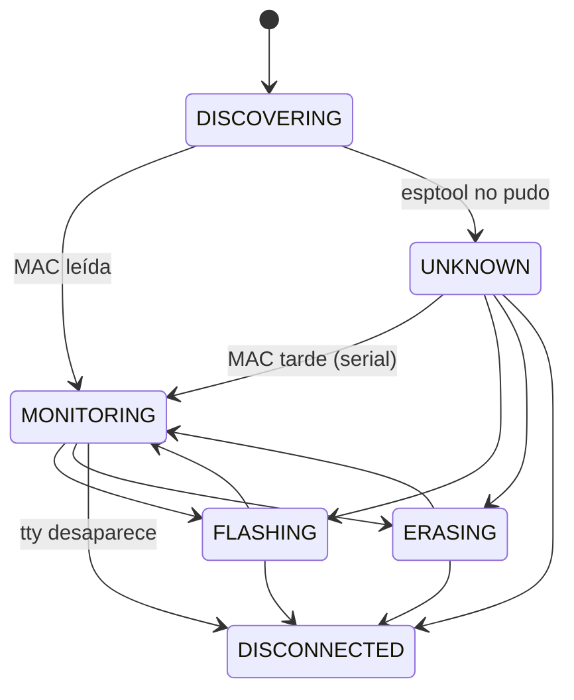

# espbench — Arquitectura

Flasheo remoto de ESP32 y monitor serie persistente. El developer compila en su
máquina; los ESP32 están enchufados a una Raspberry Pi que los flashea, los
monitorea y muestra todo en un dashboard web.

```
Máquina del developer                Raspberry Pi
─────────────────────                ─────────────────────────────────────────────
client/deploy.py ──TCP 5000+K──►  remote_esp32.py   (un proceso por device, en tmux)
client/espbench (CLI agentes) ─┘
                                    ├─ DeviceManager → TtyPort + Device (FSM) + DeviceLog
                                    ├─ EspMonitor     (esp_idf_monitor en un PTY)
                                    └─ control_server (protocol.py)
                                            │ escribe
                                            ▼
                                  /opt/esp/devices/<mac>/   log, events.jsonl, jobs, .elf
                                  /opt/esp/run/<tty>.json   estado runtime
                                            │ lee
Browser, espbench ◄──HTTP/WS 8080─  api.py (dashboard, proceso aparte)
```

---

## 1. Procesos

**Un proceso `remote_esp32.py` por device**, cada uno en su sesión tmux
(`esp32_<nombre>`), más **un proceso de dashboard** (`api.py`, systemd).

### Decisión: no consolidar los devices en un servicio único

El refactor de `feat/newArch` (`esp_ctrl`) reemplazó tmux por un servicio que
manejaba todos los devices, y terminó rompiendo todo. tmux por proceso da gratis
cuatro cosas que un servicio único tiene que reconstruir a mano:

1. **Aislamiento de fallas** — si se cuelga el monitor o esptool de un device,
   los demás siguen.
2. **Limpieza de recursos** — si el proceso muere, el sistema operativo cierra
   sus fds, PTYs y subprocesos.
3. **Reset por device** — `devremote --reset <dev>` mata y relanza solo ese.
4. **Attach interactivo** — `devremote <dev>` engancha la terminal de la sesión,
   que es donde funcionan Ctrl-E (erase) y el teclado hacia el monitor.

Consolidar no es imposible, pero requiere su propio diseño de supervisión. No
sale gratis de tener un buen modelo de objetos.

---

## 2. Modelo del device (`remote/server/device.py`)

| Objeto | Qué es | Vida |
|---|---|---|
| `TtyPort` | Puerto físico: path del tty + puerto TCP | Fijo durante toda la vida del proceso |
| `Device` | Identidad lógica, por MAC. FSM + `DeviceLog` | Arranca sin MAC; se *promueve* cuando la conoce |
| `DeviceManager` | Arma los dos, lee la MAC (con reintentos y fallback por serial), vigila que el tty siga existiendo | Uno por proceso |

`TtyPort` y `Device` están separados a propósito: el nombre del tty puede cambiar
(`ttyUSB3` → `esp-slot3`, ver §6) sin que nada del modelo lógico se entere.

### FSM



- `FLASHING`/`ERASING` vuelven al estado del que salieron. Si en el medio se
  resolvió la MAC, vuelven a `MONITORING`.
- **`UNKNOWN` puede flashear**: los chips con flash encryption no siempre dejan
  leer la MAC con esptool, y tienen que poder usarse igual.
- Las transiciones inválidas levantan `InvalidTransition`. Por ejemplo, un pedido
  de flash durante un erase se rechaza con `device_busy` antes de recibir el
  artefacto. Antes paraba el monitor en medio del erase.
- **Señales**: mientras `device.busy` (FLASHING/ERASING), el proceso ignora
  SIGTERM/SIGINT/SIGHUP, para no dejar un chip a medio escribir. Esto reemplaza
  al viejo `_ignore_signals_flag`.

Cada transición se loguea y se publica en `run/<tty>.json`.

---

## 3. Estado runtime (`remote/server/runstate.py`)

`/opt/esp/run/<tty>.json` es lo único que cruza de proceso a proceso. Lo escribe
el `Device` en cada transición, con escritura atómica (temp + `os.replace`). Lo
leen el dashboard (`DeviceRegistry`, `LogStreamer`), `esp32_tmux.sh` y
`devremote --status`.

```json
{"tty": "esp-slot3", "tty_path": "/dev/esp-slot3", "tcp_port": 5003,
 "mac": "1C:C3:AB:01:61:D4", "state": "monitoring",
 "log_path": "/opt/esp/devices/1CC3AB0161D4/output.log",
 "pid": 1234, "updated_at": "2026-10-05T16:00:00",
 "health": {"since": "...", "boots": 2, "panics": 1, "boot_loop": false,
            "last_reset": {"ts": "...", "reason": "TG1WDT_SYS_RESET", "abnormal": true},
            "last_panic": {"ts": "...", "kind": "guru", "detail": "LoadProhibited", "line": "..."}},
 "fw": {"project": "app", "version": "v1.2.3", "idf": "v5.3.2"}}
```

`health` y `fw` los arma `SerialWatch` (`serial_watch.py`) leyendo las mismas
líneas que van al log (se las pasa `DeviceLog`, §4): cuenta reinicios y panics,
detecta boot loop (**5 boots en 60 s**; un firmware en loop reinicia cada 1-10 s, y
deja lugar a unos resets a mano) y toma nombre/versión del firmware de lo que
imprime `app_init`. Lo mismo queda como eventos en `events.jsonl` (§4). Cuando cambian, el
`Device` republica sin transición (`publish()`). Los contadores vuelven a cero con los
reinicios a propósito: al empezar un flash o un erase, y con un reset pedido al
monitor (Ctrl-T Ctrl-R / Ctrl-T Ctrl-P: lo que manda `POST /command/reset|bootloader`, o
alguien enganchado con `devremote <dev>`). Las teclas de la sesión tmux pasan por
`DeviceManager.on_keys` (`EspMonitor.input_sink`) antes de llegar al monitor.
`restart-session` arranca otro proceso, con un `SerialWatch` nuevo.

**Es por tty y no por MAC** porque es el estado del *proceso*, y antes de leer la
MAC no hay otra clave posible. Los datos que tienen que seguir a la placa (log,
jobs, `.elf`) sí van por MAC.

Si el `pid` está muerto, el dashboard lo toma como DOWN (un `kill -9` no limpia
el archivo). Si el estado es `disconnected`, `esp32_tmux.sh` recrea la sesión
cuando el tty vuelve.

---

## 4. Logs

### `DeviceLog` — único escritor del log de un device

Recibe el serial crudo (`EspMonitor` → `write_serial`) y las líneas de `taglog`
(flash, esptool, transiciones). Todo queda en un archivo, que es lo que muestra
el dashboard. Una sola tubería de líneas:

```
EspMonitor ─bytes→ DeviceLog.write_serial   decoder UTF-8 incremental, corte en \n
taglog ──────────→ DeviceLog.write_taglog
                     ├ escribe "<prefijo><línea>\n" (archivo binario, offset en bytes propio)
                     └ line_sink(texto, cursor, ts) = SerialWatch.on_line   (solo serial)
```

**Formato de línea**: `YYYY-MM-DD HH:MM:SS.mmm <origen> <cuerpo>`. Origen: `>`
serial, `|` taglog, `↪` continuación de una línea serial. El cuerpo de taglog es
`INFO  | tag            | msg` (en stdout/tmux el formato no cambió). La hora es la
del primer byte de la línea en la Pi. Los `\r` internos y el ANSI quedan como
llegaron (el dashboard y `SerialWatch` se quedan con el último segmento).

```
2026-10-05 16:02:03.123 | INFO  | devicelog      | sesión 20261005_160203_812 tty=esp-slot3
2026-10-05 16:02:03.130 > rst:0x1 (POWERON_RESET),boot:0x13 (SPI_FAST_FLASH_BOOT)
2026-10-05 16:02:05.002 | INFO  | device         | esp-slot3 (mac=…): monitoring -> flashing
2026-10-05 16:02:07.410 > esp>
2026-10-05 16:02:09.950 ↪ help
```

- **Línea parcial**: la línea serial en curso se retiene en memoria hasta el `\n`,
  hasta 150 ms sin bytes nuevos (un prompt de `esp_console` no termina en `\n`) o
  hasta 1 s desde su primer byte aunque sigan llegando (`MAX_HOLD`: una línea que
  gotea no queda retenida, y el desorden de horas queda acotado a ~1 s).
  Lo que llegue después de esa línea sale con `↪`. Así una línea de taglog de otro
  hilo nunca queda pegada a una serial. El flush por tiempo lo hace un hilo por
  `DeviceLog` que duerme en una `Condition` hasta el vencimiento (no hay que
  depender de que llegue otro byte ni de un tick externo). Una línea de más de
  4096 caracteres se corta (sigue con `↪`).
- **Sesión** = una ejecución del proceso: `session_id = YYYYMMDD_HHMMSS_<pid>` (el
  pid evita colisiones si el reloj salta). La primera línea del archivo es el
  header de sesión, escrito al abrir el archivo (fuera del buffer pre-MAC).
- **Cursor** = `c:<session_id>:<offset>`, offset en bytes, siempre en fin de
  línea. El cursor de una línea (y de un evento) es el **inicio** de esa línea,
  que es el fin de la anterior: `--since <cursor>` la incluye.
- **Un archivo por sesión**: `devices/<mac>/output.log` es la sesión actual. Al
  arrancar una nueva, la anterior rota a `output_<session_id>.log` (el id sale de
  su header; un log viejo sin header usa la hora actual).
- **Antes de saber la MAC**, las líneas quedan en memoria, con tope de 256 KB (se
  descarta desde el principio). Al adoptar: header, buffer y después el marcador
  `--- adoptado desde … ---`, así los offsets relativos al buffer siguen valiendo.
- **Si la MAC no se lee nunca** (`UNKNOWN`), el log va a
  `devices/unknown-<tty>/output.log`. Si la MAC aparece más tarde, ese contenido
  se copia al **principio** del archivo de la MAC (los offsets no cambian) y el
  provisorio se borra.

Reemplazó a `tmux pipe-pane`, que copiaba a ciegas lo que salía por la terminal,
y al `serial.log` que escribía `EspMonitor` y nadie leía.

### Eventos (`remote/server/events.py`) — `devices/<mac>/events.jsonl`

Una línea JSON por evento, con la hora y el cursor del log donde pasó:

```json
{"ts":"2026-10-05T16:02:03.123","type":"panic","cursor":"c:20261005_155000_812:48213",
 "detail":{"kind":"guru","reason":"LoadProhibited","line":"Guru Meditation Error: ..."},"by":"device"}
```

| type | Lo escribe | detail |
|---|---|---|
| `session` | `DeviceLog`, al abrir el archivo (cursor = offset 0) | tty, tcp_port, pid |
| `boot` | `SerialWatch`, en cada línea `rst:` | reason, abnormal |
| `fw` | `SerialWatch`: el primero de cada sesión y cada vez que cambia (al ver la línea `ESP-IDF:`, o en el siguiente `rst:`) | project, version, idf |
| `panic` | `SerialWatch`, fuera de un boot loop | kind, reason, line |
| `boot_loop` | `SerialWatch` | phase (`start`/`end`), boots; `end`: ts = último boot + ventana, `last_boot` {ts, cursor}, `panics` (los del loop) y `first_panic`/`last_panic` (kind) |
| `state` | `Device` (FSM), en cada transición; evento y línea taglog bajo el lock del `DeviceLog` (`atomic()`) | from, to |
| `flash` | `protocol.py`, con la respuesta final y antes de reanudar el monitor (§5) | job_id, ok, status, error, user |
| `send` | api, en cada `POST /send` exitoso (cursor = antes del envío) | text, enter, user, forced? |
| `command` | api, en cada `POST /command` exitoso | command (reset/bootloader), user, forced? |
| `reserve` / `release` | api (`release` también `devremote --unlock`, forzado) | user, expires (con zona) |
| `note` | api, al cambiar la nota (`PATCH /api/devices/{mac}`) | text (`""` = borrada), user |
| `props` | api, al cambiar las propiedades | changes `{cat: {from, to}}`, user |

- **Boot loop**: mientras está activo no se registran los `boot` ni los `panic`
  sueltos (solo `start` con el conteo y `end` con los panics): un firmware que
  crashea al arrancar escribía miles de eventos por hora. El `end` se registra con la primera línea que
  llega después de que el loop venció, con el tick de cada segundo del proceso
  (`DeviceManager.tick` → `SerialWatch.poll`, así una placa muda también lo
  cierra y se republica la salud) o al empezar un flash/erase.
- `panic.kind`: `guru`, `abort`, `brownout`, `task_wdt`, `stack_overflow`, `assert`.
- Después de `close()` (desconexión) los eventos se descartan: no hay línea a la
  que apuntar.
- **Antes de la MAC** los eventos se retienen con su posición en el buffer y se
  recalculan al volcarlo. En la migración `unknown-<tty>` → MAC pasan **solo los
  eventos de la sesión actual** (el provisorio puede tener sesiones de otra placa).
- **Escritura**: `O_APPEND` y un solo `os.write()` por línea (< 4 KB), atómico en
  Linux entre procesos. Sin `flock`, sin ids, sin rotación (sin tope: por eso la
  lectura va de atrás para adelante, ver "Rangos del log"). El archivo se crea con
  modo 666: el proceso del api (sfypi) también va a escribir.
- El proceso del api escribe con `events.record(log_path, type, detail)`: cursor =
  fin de la última línea completa del `output.log` en ese momento.

### `taglog` (`remote/server/taglog.py`)

`taglog.info(TAG, msg)` / `.warn` / `.error` / `.debug`, con un `TAG` estático
por módulo. Es la misma convención que `ESP_LOGI(TAG, ...)` del firmware.

Los sinks son pluggables (`add_sink`). Cada proceso de device tiene dos: stdout
(la sesión tmux, con `\r\n` porque la terminal está en modo raw) y su
`DeviceLog`.

---

## 5. Flash (`remote/server/protocol.py`)

Una conexión TCP = un pedido (`upload_and_flash`, `pull_and_flash` o `unlock`).

```
authenticate → validate_action → check_flashable (FSM) → LockStore
→ ACK {phase: ready} → receive_artifact (upload|pull + SHA256) → extract_artifact
→ monitor_paused [device.start_flash · mon.stop]
      verificar MAC → run_flash (erase? + write, reintento sin --encrypt si rc=2)
      → .elf a devices/<mac>/current.elf, last_user
      → evento flash + result.json
  [mon.start · device.finish_flash]
→ {phase: done, ok, status, write_rc, ..., cursor}
```

- **La respuesta final sale después de `monitor_paused`**: con el monitor
  relanzado y la FSM de vuelta en `monitoring` (antes salía adentro, y un `send`
  inmediato del cliente daba 409). Lleva el `cursor` del evento `flash`.
- **El evento `flash` se registra antes de reanudar el monitor**: su cursor queda
  antes de todo lo que imprima el firmware nuevo, así `--since flash --until boot`
  ve el primer `rst:`.

- Cada paso es una función aparte, testeable con fakes (`tests/test_protocol.py`).
  Las herramientas externas (esptool, lectura de MAC) llegan en `FlashTools`.
- El job vive en `devices/<mac>/jobs/<job_id>/`, con su `job.log` adentro. Para
  un device sin MAC, en `jobs/<job_id>_<tty>/`.
- Toda respuesta final después del ACK (éxito, fallo de esptool, `device_changed`,
  SHA256 inválido...) queda también en `jobs/<job_id>/result.json` (`write_result`):
  es lo que muestra el historial del dashboard.
- **El lock queda por tty**, no por MAC, a propósito: `esp32_tmux.sh` lo libera
  al reconectar, y atarlo a la placa cambiaría ese comportamiento.

### Locks y reservas (`remote/server/locks.py`)

`locks/<tty>` = `user:token[:expires[:mac]]`. Sin vencimiento es el lock que toma
el flash (permanente hasta un unlock con el mismo par). Con vencimiento (epoch) es
una **reserva** (`POST /api/device/{tty}/reserve`, §8), con la MAC de la placa
(12 hex sin `:`, que es el separador del archivo).

- Reserva y flash usan **el mismo par** `lock_user`/`lock_token`: el flash del
  dueño de la reserva pasa, y `LockStore.acquire` conserva el vencimiento y la MAC
  (no la convierte en un lock permanente).
- **Vencido = inexistente** en todos lados (`LockStore`, `DeviceRegistry`, api):
  `locks.read()` lo ignora y la próxima escritura lo pisa. No se borra al leerlo
  (entre la lectura y el borrado otro proceso podía escribir una reserva nueva).
- **Exclusión**: todo leer-decidir-escribir (`LockStore.acquire`/`unlock`,
  `/reserve`, `/release`, `/unlock`, la limpieza al arrancar) va dentro de
  `locks.exclusive(tty)`: `flock` sobre `locks/<tty>.lck` (666).
- **Reconexión**: `esp32_tmux.sh` borra solo los locks sin vencimiento (los del
  flash, como siempre; misma regla que `locks.parse`: un lock viejo con `:` en el
  token es permanente). Una reserva vigente sobrevive el replug; al arrancar,
  `remote_esp32.py` la borra si su MAC no es la de la placa que encontró (los
  `ttyUSB` se renumeraron).
- `user` y `token` pueden tener `:` (había `.flashcfg.json` así): en el archivo van
  escapados (`:` → `%3A`, `%` → `%25`), así `:` sigue siendo solo el separador. Un
  par sin `:` ni `%` se escribe igual que siempre, y un lock viejo con `:` literal en
  el token se lee como permanente. Solo se rechazan vacíos o con saltos de línea.
- La escritura es atómica (temp + `os.replace`) y el archivo queda 666: lo escribe
  root (device) y lo borra sfypi (api); `locks/` es 777.

---

## 6. Nombres y puertos (`remote/infra/espbench-name`)

`ttyUSBN` es el orden en que el kernel enumeró los devices, no el puerto físico:
un replug o un reboot puede cambiarlo. `espbench-name` es **la única fuente** de
la regla de nombre y puerto. El proceso Python recibe el puerto ya resuelto por
`--control-port`.

| Caso | Nombre | Puerto TCP |
|---|---|---|
| Sin `/opt/esp/slots.conf` | `ttyUSBN` | `5000+N` (comportamiento histórico) |
| Puerto físico mapeado en `slots.conf` | `esp-slotK` | `5000+K` |
| Hay `slots.conf` y el device no está mapeado | `ttyUSBN` | `5100+N` (no choca con los slots) |

`slots.conf` tiene una línea por puerto físico del hub: `<K> <ID_PATH>`.
`devremote --slots` muestra el `ID_PATH` de lo que está enchufado. Una regla udev
crea el symlink `/dev/esp-slotK` y la sesión corre sobre él, así que la sesión,
el estado runtime y el lock quedan atados al puerto físico.

---

## 7. Sesiones y hotplug (`remote/infra/`)

```
enchufar ──► udev (99-esp32.rules) ──► systemd espbench-attach@ttyUSBN
                                            └─► devremote --start (como sfypi)
boot ─────► devremote.service ─────────────────► devremote (escanea /dev/ttyUSB*)
                                                      └─► esp32_tmux.sh /dev/ttyUSBN
                                                             └─► tmux esp32_<nombre>: remote_esp32.py
```

- El hotplug pasa por systemd y no por `RUN+=` de udev. Lo que udev lanza corre
  en el tmux server de root y se mata al terminar el evento. La regla anterior
  hacía eso, y en la práctica el hotplug no funcionaba.
- `devremote`: `--status`, `--reset [<dev>]`, `--unlock <dev>`, `--slots`,
  `--cleanup`, `<dev>` (attach). `<dev>` acepta `N`, `ttyUSBN`, `esp-slotK` o
  `slotK`.
- Desconexión: el watcher del proceso ve que el tty desapareció → `DISCONNECTED`
  → el proceso termina. Cuando el tty vuelve, `esp32_tmux.sh` recrea la sesión.

---

## 8. Dashboard (`remote/server/api.py` + `remote/dashboard/`)

| Endpoint | |
|---|---|
| `GET /api/update`, `POST /api/update` `{ref?, force?}` | Estado del último update y PIN; lanzar `espbench-update` (§13) |
| `GET /api/version` | `{app: "espbench", version, name, auth}`: identidad del bench para bench-master (`name` sale de `/opt/esp/bench_name` o del hostname) y si hay token de la API |
| `GET /api/devices`, `GET /api/device/{tty}`, `GET /api/device/by-key/{key}` | `DeviceRegistry` |
| `PATCH /api/devices/{mac}` `{device_key?, note?, props?, props_add?, props_remove?, user?}` | Renombrar, nota y propiedades de la placa (`devices.json`, ver "Nota y propiedades") |
| `GET /api/properties` | Categorías de propiedades (fijas) con los valores de este bench |
| `POST /api/properties/{cat}/values` `{id, label?, desc?, warn?, exclude_pick?}`, `DELETE /api/properties/{cat}/values/{valor}` | Agregar un valor a una categoría; borrarlo si ninguna placa lo usa (409 `in_use`) |
| `POST /api/device/{tty}/unlock` `{lock_user, lock_token}` o `{force: true}` | Liberar lock con el par, como `release`; `force: true` (el dashboard, después de confirmar) lo suelta sin el par y **exige** token de la API (sin `/opt/esp/api_token` → 403 `force_disabled`). Evento `release` con el dueño anterior y, si se forzó, `by_user`/`by_host` |
| `POST /api/device/{tty}/reserve` `{lock_user, lock_token, ttl_s, expect_mac}` | Reserva con vencimiento (§5): `ttl_s` default 1800, **máximo 24 h** (más → 400); `expires` con la zona de la Pi; 409 `locked` si la tiene otro; 409 `busy` si la placa todavía no tiene MAC; renueva si es propia |
| `POST /api/device/{tty}/release` `{lock_user, lock_token}` | Suelta el lock con el mismo par (403 si no) |
| `POST /api/device/{tty}/command/{reset\|bootloader}` | Teclas al monitor vía `tmux send-keys`; 409 `busy` si flashea/borra, 502 si tmux falla; evento `command`. Body opcional: `expect_mac`, par del lock, `force`, `require_reservation` |
| `POST /api/device/{tty}/devremote-reset` | `devremote --reset <tty>`; mismas reglas de reserva que `command` (423 `locked`, `force`, `require_reservation`, `expect_mac`); evento `command` con `command: restart-session`. `tmux` y `devremote` corren en un thread (`asyncio.to_thread`): no frenan el event loop |
| `GET /api/device/{tty}/jobs`, `.../jobs/{job_id}/log` | Historial de flasheos (`history.py`, `result.json`) |
| `GET /api/device/{tty}/sessions`, `.../sessions/{name}[?download=1]` | Sesiones de log (actual + rotadas) |
| `POST /api/device/{tty}/send` `{text, enter, expect_mac?, lock_user?, lock_token?, force?}` | Texto al serial vía `tmux send-keys -l`; 409 `busy` si flashea/borra. Devuelve `cursor` (fin del log antes del envío) y registra el evento `send` |
| `WS /ws/device/{tty}` | `LogStreamer`: el log del device en vivo |
| `GET /api/board/{key}/log?since=&until=&around=&before=&after=&max_lines=&grep=&src=&raw=&echo=` | Rango del log de una placa (`logrange.py`, ver abajo) |
| `GET /api/board/{key}/events?type=a,b&since=&limit=&order=&counts=` | Eventos de la placa, ordenados por (sesión, offset): los últimos `limit` (50), o los primeros desde `since` con `order=asc`; `more` si quedaron afuera; `counts=1`: además `{tipo: n}` de todos desde `since` (sin el filtro de tipo) |

- **Token (opcional)**: si existe `/opt/esp/api_token` (`auth.py`, se lee en cada
  pedido), las escrituras (POST/PATCH) exigen `Authorization: Bearer <token>` →
  401 `auth`; las lecturas siguen abiertas. Es también el token del flash si la
  sesión no recibe `--token` (A2): con el archivo creado, un `.flashcfg.json` sin
  `token` deja de flashear. El dashboard (`auth.js`) lo pide una vez ante un 401 y
  lo guarda en `localStorage`. **Falla cerrado**: solo un archivo inexistente (o
  vacío) es "sin token"; si existe y no se puede leer (permisos, directorio, no es
  UTF-8) las escrituras dan 500 `auth_config` y el flash `auth_config`. Las
  comparaciones son en tiempo constante (sobre bytes).
- **Las lecturas no piden token**: `/api/board/{key}/log|events`, el WebSocket y los
  `GET` exponen el log entero y el texto de cada `send` (queda en `events.jsonl`)
  a cualquiera en la red. No mandar secretos por la consola serie.
- **Errores** de las escrituras (y de `/api/board`): `{"detail": {"error", "message"}}`.
  `error` es el contrato del CLI (spec §8.3): `bad_request`, `busy` (409),
  `device_changed` (409: `expect_mac` no es la MAC del tty), `locked` (423: placa
  reservada por otro; 409 en `reserve`), `token_mismatch` (403), `not_found`,
  `bad_anchor`, `cursor_expired`, `session_down` (502: tmux no tiene la sesión del device).
- **Reservas (A3)**: una reserva vigente bloquea `send`/`command` de cualquiera que
  no mande el mismo par (423 `locked`). El lock permanente del flash no bloquea.
  `force: true` (solo el booleano) la saltea: el dashboard lo manda después de
  confirmar, el CLI nunca; queda `forced: true` en el evento, con `by_user` (el
  `lock_user` del pedido) y `by_host`. Forzar un `unlock` exige token de la API. `require_reservation:
  true` (el CLI): la escritura sale solo si el par tiene la reserva vigente, chequeado
  en el mismo pedido → 423 `reservation_lost`.
- `send`, `reserve` y `release` (también `unlock`) quedan en `events.jsonl` (`events.record`, cursor =
  fin del log en ese momento; el de `send` es el previo al envío y solo se
  registra si tmux lo mandó).
- **Lecturas por placa** (`/api/board/{key}`): `key` = `device_key`, SN o MAC (con
  o sin separadores), resuelto con `devices.json` (`DevicesFile.resolve_board`).
  Funcionan con la placa desconectada (los datos viven en `devices/<MAC>/`); la
  sesión "actual" de una placa desconectada es la última. Escrituras por tty, con
  `expect_mac`.

### Nota y propiedades por placa (`remote/server/board_meta.py`)

Por MAC en `devices.json` (`DevicesFile.set_meta`: un leer-modificar-escribir con el flock), expuestos en
`/api/devices` y `/api/device/{tty}` (`note`, `note_by`, `note_at`, `props`). Ninguno es un lock: el server no
bloquea nada por una nota o una propiedad; el CLI y el dashboard los muestran, y `espbench pick` los respeta.

- **Nota**: texto libre ("testeando, no tocar"), hasta 200 caracteres, sin caracteres de control; `""`/`null` la
  borra. `note_by` = `user` del pedido (el CLI manda `ESPBENCH_USER`; el dashboard el `lock_user` recordado) o, sin
  él, el host del pedido. `note_at`: ISO con la zona de la Pi. Misma nota = sin cambios (ni evento).
- **Propiedades**: categorías **fijas**, en el código (`board_meta.CATEGORIES`): `estado` (un valor), `uso`
  (varios), `chip` (uno), `conectividad` (varios), `perifericos` (varios). Los **valores** son de cada bench:
  `/opt/esp/properties.json` (flock + escritura atómica), sembrado con el set inicial de cada categoría (leer no lo
  crea; lo escribe el primer alta/baja). Se agregan valores a una categoría existente (nunca categorías); uno se
  borra solo si ninguna placa lo usa (409 `in_use`). En `estado`, un valor puede ser `warn` (estilo de advertencia)
  y `exclude_pick` (`espbench pick` / `ls --free` no eligen la placa): `no-tocar` y `roto` vienen así.
- Por placa: `props = {"chip": "esp32-s3", "conectividad": ["wifi", "lte"]}`. `props` reemplaza la categoría
  (`null`/`""`/`[]` la quita), `props_add`/`props_remove` suman o sacan valores (en una categoría de un solo valor,
  `add` = poner). Solo valores del catálogo (400 con los válidos y el más parecido); quitar vale para cualquiera.
- Escritura: token de la API como las demás; eventos `note` / `props` en el `events.jsonl` de la placa (si su log
  tiene sesión); alta/baja de valores, por taglog.

### Rangos del log (`remote/server/logrange.py`, spec §5 y §7.3)

- **Anchors** (`since`, `around`): `now`, `session`, un tipo de evento con ordinal
  (`boot`, `panic~1`: en la sesión actual, ordenados por offset, no por orden en
  el archivo), tiempo (`500ms`, `5m`, `16:02`, `2026-10-05T16:02`, zona de la Pi; una hora
  posterior a ahora es de ayer) y cursores `c:<sesión>:<offset>` (a mitad de línea
  → inicio de la línea; sesión que ya no está → `cursor_expired`). `since` default:
  `session`.
- **Tiempo**: búsqueda lineal hacia atrás hasta una línea con hora < T − 2 s (las
  horas del archivo no son monótonas, §4) y hacia adelante hasta la primera ≥ T.
  Las líneas sin prefijo no cuentan.
- **`until`**: el primer X después de `since`, en la misma sesión. Un tipo de
  evento sale de `events.jsonl`, leído **después** de fijar el tamaño del log (un
  evento que no estaba aparece con cursor ≥ `end` en el próximo poll); `boot` y
  `panic` se buscan en las líneas con la detección de `SerialWatch` (`line_kind`),
  porque el evento se escribe un instante después que su línea. Un patrón
  (`re:<regex>` o substring) se evalúa sobre el texto sin prefijo ni ANSI, con el
  `\r` aplicado y sobre la línea lógica (`>` + sus `↪`, aunque haya taglog en el
  medio). `echo=<texto>`: la primera línea lógica que termina con él (el eco de
  `send`) no cuenta. Sin match: `until_found: false`, `end` = fin del log. Con match,
  `match_cursor` = inicio de la línea lógica del match (`--verify` lo compara con el
  cursor de un `boot_loop`).
- **`events.jsonl` sin tope**: se lee **una vez por pedido** (`_Events`, después de
  fijar el tamaño del log) y, para la sesión actual, **de atrás para adelante**
  hasta 64 eventos seguidos fuera del rango (`EVENT_SLACK`: device y api escriben en
  paralelo y el orden del archivo no es exactamente el del log). Las líneas de otra
  sesión o de otro tipo no se parsean (el cursor y el tipo se miran en los bytes). Un
  cursor de una sesión anterior lee el archivo entero (raro). `/events` sin `since`
  (los últimos N) también lee la cola; `counts=1` cuenta todo el archivo de forma
  incremental (solo crece; un inode distinto arranca de cero).
- **Patrones del usuario** (`grep`, `until=re:`; las lecturas no piden token):
  hasta 256 caracteres, se evalúan los primeros 4096 de cada línea, y con el
  módulo `regex` cada búsqueda tiene timeout de 0,1 s y el pedido 2 s en total
  (`bad_request`). Sin `regex` instalado se rechazan los cuantificadores anidados y las alternancias cuantificadas
  (`(a+)+`), que son los que explotan.
- **`around`**: del `rst:` anterior a E (inclusive) al siguiente (exclusive), o
  `before`/`after` líneas. No se combina con `since`/`until`.
- **Salida**: líneas compactas (`HH:MM:SS.mmm <origen> <texto>`, con fecha si no es
  la de `date`), sin ANSI salvo `raw=1`, progreso de esptool colapsado, `src`
  (`serial`/`taglog`/`all`), `grep`, y con más de `max_lines` (default 200, tope
  5000) las primeras 50 + las últimas y un marcador. `session_ended`: la sesión del
  rango no es la actual o no hay proceso vivo escribiéndola. `partial` siempre es
  `null`: la línea en curso vive en la memoria del proceso del device (sale al
  archivo a los 150 ms / 1 s).
- Las rutas `/api/device/{tty}/...` de GET tienen que declararse **antes** de
  `/api/device/{tty:path}`, que si no se las come (hay test).
- **Dashboard (fase 4)**: pestaña Eventos en `device.html` (`/api/board/{MAC}/events`,
  chips por tipo, "cargar más" con `limit`/`more`, visor del evento con
  `/log?around=<cursor>`, también de sesiones anteriores), marcas de eventos en el
  log en vivo (panic/boot por contenido de línea, con las regex de `line_kind`
  —`tests/test_linemark_parity.py`—; send/command/flash por hora del evento y el
  eco, porque el WebSocket no lleva offsets) y reservas visibles (`lock_expires`
  con "vence en" que se actualiza solo, contador y `@usuario` en la home, liberar
  con el par o forzar con `unlock {force: true}`). Detalle en `remote/dashboard/CLAUDE.md`.
- `DeviceRegistry` lista un device por puerto físico (`esp-slotK` en vez del
  `ttyUSB` al que apunta). El estado, la MAC y el puerto salen de
  `run/<tty>.json`. Sin estado runtime, cae al esquema anterior (`tmux
  has-session`, `logs/<tty>/mac`).
- **URLs relativas** en todo el frontend (`api/...`, `style.css`, `ws/...` vía `EB.wsUrl`): la misma página funciona servida directo (`/`) o a través del proxy de bench-master (`/bench/<nombre>/`).
- `LogStreamer` sigue el `log_path` que publica el device. Cuando el archivo rota
  (cambió el inode), lo lee desde el principio.
- `devices.json` (MAC → nombre amigable + modelo de HW) lo comparten todos los
  procesos. La escritura es con `flock`, y el `flush`+`fsync` se hace **antes**
  de soltar el lock: sin eso, dos `register_mac` simultáneos corrompían el
  archivo (pasaba con `devremote --reset`).

---

## 9. Filesystem en la Pi

```
/opt/esp/
├── server/                código (copia de remote/server/)
├── dashboard/             frontend (copia de remote/dashboard/)
├── venv/                  Python + esptool + esp-idf-monitor + fastapi
├── devices.json           MAC → {device_key, hw_model, note?, note_by?, note_at?, props?}
├── properties.json        valores de las propiedades de este bench (las categorías están en el código)
├── slots.conf             (opcional) <K> <ID_PATH>
├── run/<tty>.json         estado runtime de cada sesión
├── devices/<MAC>/
│   ├── output.log         log de la sesión actual (con header de sesión)
│   ├── output_<session_id>.log  sesiones anteriores (output_<ts>.log: logs viejos)
│   ├── events.jsonl       eventos de la placa (todas las sesiones)
│   ├── current.elf        para decodificar backtraces
│   ├── last_user
│   └── jobs/<job_id>/     artefacto extraído + job.log
├── devices/unknown-<tty>/ log y eventos de un device sin MAC
├── locks/<tty>            "user:token[:expires[:mac]]" (lock del flash / reserva)
├── api_token              (opcional) token de las escrituras del API y del flash
└── jobs/, logs/, current_<tty>.elf   esquema anterior / devices sin MAC
```

`devremote --cleanup` borra jobs y sesiones de log viejas. La sesión actual
nunca se toca. `events.jsonl` no se limpia: los eventos de una sesión borrada
quedan, y pedir su contexto (`--around <cursor>`) da `cursor_expired` (esperado).

---

## 10. Tests

`pytest tests/`, en el host y sin hardware. `tests/conftest.py` aísla `ESP_BASE`,
así que ningún test toca el `/opt/esp` real.

| Qué | Cómo |
|---|---|
| Modelo, FSM, `DeviceLog`, `SerialWatch`, `events`, `runstate`, `taglog`, `paths` | unitarios (eventos: dos procesos escribiendo el mismo archivo) |
| `protocol.py` | pedido completo por `socketpair`, esptool falso (`test_protocol.py`) |
| Entrypoint | `remote_esp32.main()` con fakes solo en esptool/monitor/TCP (`test_remote_esp32.py`) |
| Scripts de infra | los scripts reales con `tmux`/`udevadm`/`pkill` falsos (`test_infra.py`) |
| Dashboard | `DeviceRegistry`, `LogStreamer` (rotación, `log_path` por estado runtime), `history`, endpoints de `api.py` llamados directo (`test_api.py`) |
| Frontend | lógica de `remote/dashboard/espbench.js` con `node --test` (`tests/js/`, lo corre `test_dashboard_js.py`) |
| Contratos duplicados (Python ↔ JS, server ↔ cliente) | prefijo de línea, cursor, nombre de sesión (`test_contract_parity.py`) y marcas de panic/boot (`test_linemark_parity.py`) sobre los mismos casos |
| Cliente | `espbench_lib` y el CLI contra `tests/benchsim.py` (API real + `DeviceManager`/`DeviceLog` reales, tmux y esptool falsos) |

**Solo se verifica en la Pi**: la regla udev de slots, el hotplug vía systemd, el
reloj al boot (NTP / sin red) y todo lo que depende de `esp_idf_monitor`/esptool con
hardware real (offsets con sus `\r\n` y backtraces, eco y prompt de `esp_console`,
re-enumeración USB de S3/C3, panics reales, resets por RTS), más la concurrencia y la
carga con varios agentes. La lista priorizada (P0 despliegue → P3 infra), para
correr después de cada update grande: **[docs/PI_CHECKLIST.md](PI_CHECKLIST.md)**.

---

## 11. Cliente (`client/`)

Dos entradas sobre una misma librería:

```
deploy.py (humanos: input(), rich, modo custom) ─┐
espbench.py (CLI de agentes: --json, exit codes) ─┴─► espbench_lib.py ─┬─ HTTP 8080: /api/devices, /api/board/{key}/log|events,
                                                                         │             /api/device/{tty}/send|command|reserve|release
                                                                         └─ TCP 5000+K: flash (collect_artifact + flash_one)
```

- **El contrato es el string `error`** (spec §8.3): cada error de la API, del protocolo del flash o de red se
  traduce a uno, y de ahí sale el exit code. El cliente nunca distingue por status HTTP (hay varios 409 y 423).
- **La espera la lleva el cliente, el `until` lo evalúa el server** (D6): `read_range` hace polls cada 0,3 s
  desde el `end` anterior, manda `echo` hasta recibir `echo_seen`, y resuelve en el cliente `idle:`, `--for` y
  `--timeout`.
- **Crash durante una espera** (panic, boot loop): sale de `/events`, no de los `events` de cada respuesta de
  `/log`. El cursor de un evento es el inicio de su **línea lógica**: un panic que llega como `↪` de un prompt
  `esp> ` queda con el cursor del prompt, anterior al poll que lo trae (y a veces al inicio del rango). Por eso
  cuenta todo crash con cursor en el rango y todo `panic` **nuevo** (no estaba en la foto tomada antes de
  escribir) de la misma sesión. Solo `panic`: un `boot` tiene su propia línea `rst:`, y el boot recién encontrado
  por su línea (evento atrasado) no es un reinicio. También cubre el evento escrito un instante después de su línea.
- **`idle:`** en `send`: el eco no es la respuesta; el silencio cuenta desde la primera línea después del eco.
- **Verify** (`flash`/`reset --verify`): el primer `boot` desde el cursor del flash/command; si la sesión termina
  sin boot (S3/C3: el reset re-enumera el USB y arranca otro proceso), espera la sesión nueva (`/events` →
  `session`) y sigue ahí. Después, una ventana de asentamiento: otro reinicio (por su línea `rst:`: en un boot loop
  no hay eventos `boot`), un `panic` o un `boot_loop` = `crashed`. Un `boot_loop` que **empieza en el boot
  encontrado** (mismo cursor que `match_cursor`: resets que no pasaron por el monitor, como el botón EN) no es un
  crash del firmware nuevo: sale `boot_loop: true`, informativo.
- **Reserva**: el cliente que reservó guarda un registro local por MAC (`~/.cache/espbench/reservations.json`) y desde ahí
  sus escrituras van con `require_reservation` → `reservation_lost` si venció o la soltó otro. `expect_mac` en
  todas las escrituras. `force` nunca.
- **Config**: flags > env > `~/.config/espbench.json` (perfiles) > `.flashcfg.json` > **discovery**.
- **Discovery** (sin host, o `host: "auto"`; `--bench <n>` lo fuerza aunque haya `ESPBENCH_HOST`): los benches de
  `client/benches.py` (§12). `ls` y `events --all` van a todos (cada placa con `bench`; un bench que no contesta va
  en `errors`, no frena al resto); un comando con `<dev>` busca la placa en todos (`benches.resolve`: device_key,
  SN, MAC, tty, `<dev>@<bench>`, `<bench>/<tty>`) y sigue contra ese bench, con `bench` en la respuesta. Ambigua →
  `ambiguous` (exit 7, `matches` con dónde está); no está → `not_found`. Los benches viejos (sin `app: espbench`)
  se ignoran. **Costo**: el scan sondea `/api/version` de cada peer online de la tailnet (en paralelo, hasta
  `timeout_s` = 2 s por peer que no contesta); la lista de benches se cachea 30 s en
  `$ESPBENCH_STATE_DIR/benches.json` y los devices se piden en cada comando. Si la placa no está en los benches de
  la cache, se escanea de nuevo una vez. `espbench benches` siempre escanea.
- **`ls`/`status`**: `available` = `monitoring` y sin lock, o con lock propio (un lock ajeno, aunque sea el
  permanente de un flash, no deja flashear ni reservar), y sin `estado` excluido (`exclude_pick`: `avoid`).
- **`pick`**: la primera placa `available`, con MAC, sin boot loop y que cumple los `--where` (AND), en todos los
  benches (o el configurado); las que tienen nota van al final. Con `--reserve` la reserva en el mismo comando y, si
  otro la toma entre la lista y la reserva (`locked`, `busy`, `device_changed`), prueba la siguiente. Ninguna →
  `not_found`. La nota y las propiedades son avisos: el server no bloquea nada por ellas (§8).
- `fcntl` es opcional (Windows): sin él, el registro local de reservas va sin `flock`.

Tests: contra `tests/benchsim.py`, una Pi simulada con la API real y `DeviceManager`/`DeviceLog` reales (§10).

---

## 12. bench-master (`master/` + `client/benches.py`)

Un *bench* es cualquier host que corre el dashboard (`api.py`, :8080): una Pi u otra máquina. bench-master
centraliza todos, y corre **en la máquina del dev**, no en un bench.

```
client/benches.py ── tailscale status --json (peers online) + ~/.config/espbench-benches.json
      │                 └─ GET :8080/api/version → {app: "espbench", name}  ¿es bench? ¿cómo se llama?
      ├─ deploy.py      remote sin host / host "auto" → resolve(key) → bench + puerto TCP
      ├─ espbench (CLI) sin host → scan_cached (lista de benches 30 s) → ls de todos / resolve(<dev>) (§11)
      └─ master/app.py  poll cada 5 s → BenchCache
                          ├─ /api/benches, /api/devices, /api/resolve/{key}
                          └─ /bench/<nombre>/... → proxy HTTP + WS al dashboard de ese bench
```

- **Identidad**: la declara el bench (`/opt/esp/bench_name` o hostname), no la fuente. El mismo bench visto
  por LAN y por Tailscale cuenta una vez; renombrarlo en la tailnet no lo cambia. Un bench sin actualizar
  (`/api/version` solo con `version`, o `version` + `auth`) se acepta con el nombre de la fuente.
- **Tailscale**: se prueban todos los peers online (sin patrón de nombre: un bench puede no llamarse `sensipi*`).
  Los offline no se prueban (sería un timeout por cada uno).
- **Resolve**: device_key, SN, MAC, tty, `<dev>@<bench>` o `<bench>/<tty>`. Si la key está en dos benches, error
  con los dos (`ResolveError.kind == "ambiguous"`, `hits`): no se elige uno al azar para flashear.
- **Offline**: el bench queda en la lista con el último snapshot de sus devices (en memoria).
- **Proxy**: sirve el frontend del propio bench (consistente con su API) bajo `/bench/<nombre>/`; por eso el
  frontend usa URLs relativas (§8).
- **Seguridad**: el master escucha en 127.0.0.1 y rechaza `Host` ajeno (DNS rebinding) y escrituras/WebSocket con
  `Origin` ajeno (CSRF). El control de acceso a los benches es de Tailscale: ver `docs/security.md`.

---

## 13. Updates del bench (`remote/infra/espbench-update`)

```
espbench-update.timer (boot+3 min, 04:00) ─► espbench-update --auto ─┐
POST /api/update (bench-master ⟳) ─► sudo systemd-run ─► --ref X / --release ─┤
sudo espbench-update / update.sh [ref] ──────────────────────────────────────┘
      └─ /opt/esp/update.conf (REPO_DIR, PIN) → git fetch → checkout --detach <target>
         → install.sh → restart dashboard → devremote --reset → /api/version == VERSION ?
                                                                 └─ no: checkout del commit anterior + install (rollback)
```

- **Qué sigue un bench**: el último tag `vX.Y.Z` (orden de versión, no de fecha), salvo que tenga **PIN**: una rama,
  tag o commit fijado con `--ref` (para probar algo sin release). `--auto` no toca un bench con PIN; `--release` lo
  saca. Una instalación nueva desde un clone que no está en un release queda con PIN en su rama.
- **Dónde está el clone**: `install.sh` escribe `REPO_DIR` en `update.conf`. Convención: `/opt/espbench`, de root:
  el update corre como root (git incluido) y nadie toca ese clone a mano.
- **Rollback**: el chequeo es que el dashboard conteste `/api/version` con el `VERSION` del commit nuevo en ≤ 60 s.
  Si no, vuelve al commit anterior con el mismo camino. `update_status.json` queda en `rolled_back` (o `failed` si
  el rollback tampoco levanta: hay que entrar al bench).
- **Ocupado**: `--auto` no actualiza con una placa flasheando/borrando o una reserva vigente (`server/update.py`,
  `busy_reason`); el manual falla salvo `--force`. Un lock de flash (sin vencimiento) no cuenta.
- **Desde la API**: `POST /api/update` (`{ref?, force?}`, con el token si hay `api_token`) lanza el script con
  `sudo systemd-run` en su propio unit: el update reinicia el dashboard, así que no puede ser hijo de él. `GET
  /api/update` = `{version, pin, status}`.
- **Un update a la vez**: lock con `mkdir` (`update.lock` con el pid; uno de un proceso muerto se toma).
- El script corre de una copia temporal: `install.sh` reemplaza `/usr/local/bin/espbench-update` mientras corre.
- **Riesgo**: quien pueda pushear tags al repo controla todos los benches sin PIN. Hoy el repo es de un solo dueño.
