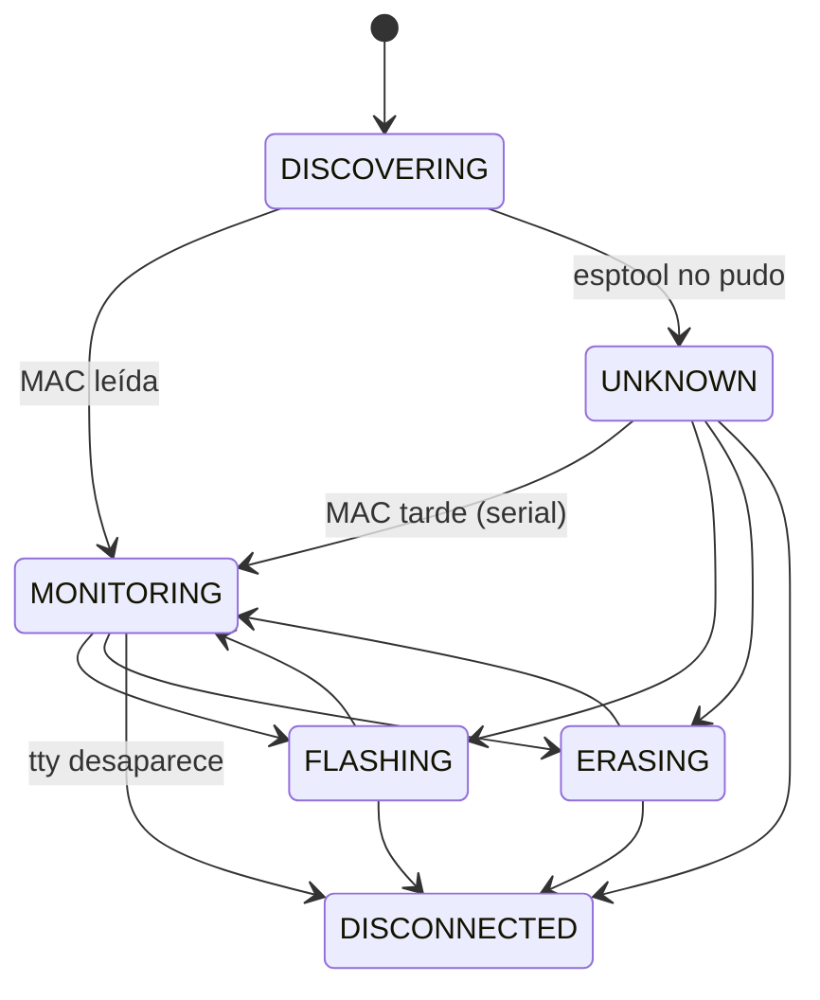

# espbench — Arquitectura

Flasheo remoto de ESP32 y monitor serie persistente. El developer compila en su
máquina; los ESP32 están enchufados a una Raspberry Pi que los flashea, los
monitorea y muestra todo en un dashboard web.

```
Máquina del developer                Raspberry Pi
─────────────────────                ─────────────────────────────────────────────
client/deploy.py ──TCP 5000+K──►  remote_esp32.py   (un proceso por device, en tmux)
                                    ├─ DeviceManager → TtyPort + Device (FSM) + DeviceLog
                                    ├─ EspMonitor     (esp_idf_monitor en un PTY)
                                    └─ control_server (protocol.py)
                                            │ escribe
                                            ▼
                                  /opt/esp/devices/<mac>/   log, jobs, .elf
                                  /opt/esp/run/<tty>.json   estado runtime
                                            │ lee
Browser ◄──HTTP/WS 8080──────────  api.py (dashboard, proceso aparte)
```

---

## 1. Procesos

**Un proceso `remote_esp32.py` por device**, cada uno en su sesión tmux
(`esp32_<nombre>`), más **un proceso de dashboard** (`api.py`, systemd).

### Decisión: no consolidar los devices en un servicio único

El refactor de `feat/newArch` (`esp_ctrl`) reemplazó tmux por un servicio que
manejaba todos los devices, y terminó rompiendo todo. tmux por proceso da gratis
cuatro cosas que un servicio único tiene que reconstruir a mano:

1. **Aislamiento de fallas** — si se cuelga el monitor o esptool de un device,
   los demás siguen.
2. **Limpieza de recursos** — si el proceso muere, el sistema operativo cierra
   sus fds, PTYs y subprocesos.
3. **Reset por device** — `devremote --reset <dev>` mata y relanza solo ese.
4. **Attach interactivo** — `devremote <dev>` engancha la terminal de la sesión,
   que es donde funcionan Ctrl-E (erase) y el teclado hacia el monitor.

Consolidar no es imposible, pero requiere su propio diseño de supervisión. No
sale gratis de tener un buen modelo de objetos.

---

## 2. Modelo del device (`remote/server/device.py`)

| Objeto | Qué es | Vida |
|---|---|---|
| `TtyPort` | Puerto físico: path del tty + puerto TCP | Fijo durante toda la vida del proceso |
| `Device` | Identidad lógica, por MAC. FSM + `DeviceLog` | Arranca sin MAC; se *promueve* cuando la conoce |
| `DeviceManager` | Arma los dos, lee la MAC (con reintentos y fallback por serial), vigila que el tty siga existiendo | Uno por proceso |

`TtyPort` y `Device` están separados a propósito: el nombre del tty puede cambiar
(`ttyUSB3` → `esp-slot3`, ver §6) sin que nada del modelo lógico se entere.

### FSM



- `FLASHING`/`ERASING` vuelven al estado del que salieron. Si en el medio se
  resolvió la MAC, vuelven a `MONITORING`.
- **`UNKNOWN` puede flashear**: los chips con flash encryption no siempre dejan
  leer la MAC con esptool, y tienen que poder usarse igual.
- Las transiciones inválidas levantan `InvalidTransition`. Por ejemplo, un pedido
  de flash durante un erase se rechaza con `device_busy` antes de recibir el
  artefacto. Antes paraba el monitor en medio del erase.
- **Señales**: mientras `device.busy` (FLASHING/ERASING), el proceso ignora
  SIGTERM/SIGINT/SIGHUP, para no dejar un chip a medio escribir. Esto reemplaza
  al viejo `_ignore_signals_flag`.

Cada transición se loguea y se publica en `run/<tty>.json`.

---

## 3. Estado runtime (`remote/server/runstate.py`)

`/opt/esp/run/<tty>.json` es lo único que cruza de proceso a proceso. Lo escribe
el `Device` en cada transición, con escritura atómica (temp + `os.replace`). Lo
leen el dashboard (`DeviceRegistry`, `LogStreamer`), `esp32_tmux.sh` y
`devremote --status`.

```json
{"tty": "esp-slot3", "tty_path": "/dev/esp-slot3", "tcp_port": 5003,
 "mac": "1C:C3:AB:01:61:D4", "state": "monitoring",
 "log_path": "/opt/esp/devices/1CC3AB0161D4/output.log",
 "pid": 1234, "updated_at": "2026-10-05T16:00:00",
 "health": {"since": "...", "boots": 2, "panics": 1, "boot_loop": false,
            "last_reset": {"ts": "...", "reason": "TG1WDT_SYS_RESET", "abnormal": true},
            "last_panic": {"ts": "...", "kind": "guru", "detail": "LoadProhibited", "line": "..."}},
 "fw": {"project": "app", "version": "v1.2.3", "idf": "v5.3.2"}}
```

`health` y `fw` los arma `SerialWatch` (`serial_watch.py`) leyendo el mismo serial
que va al log: cuenta reinicios y panics, detecta boot loop (3 boots en 2 min) y
toma nombre/versión del firmware de lo que imprime `app_init`. Cuando cambian, el
`Device` republica sin transición (`publish()`). Al empezar un flash o un erase los
contadores vuelven a cero: esos reinicios son a propósito.

**Es por tty y no por MAC** porque es el estado del *proceso*, y antes de leer la
MAC no hay otra clave posible. Los datos que tienen que seguir a la placa (log,
jobs, `.elf`) sí van por MAC.

Si el `pid` está muerto, el dashboard lo toma como DOWN (un `kill -9` no limpia
el archivo). Si el estado es `disconnected`, `esp32_tmux.sh` recrea la sesión
cuando el tty vuelve.

---

## 4. Logs

### `DeviceLog` — único escritor del log de un device

Recibe el serial crudo (`EspMonitor` → `write_bytes`) y las líneas de `taglog`
(flash, esptool, transiciones). Todo queda en un archivo, que es lo que muestra
el dashboard.

- **Un archivo por sesión**: `devices/<mac>/output.log` es la sesión actual. Al
  arrancar una nueva, la anterior rota a `output_<ts>.log`.
- **Antes de saber la MAC**, el log queda en memoria, con tope de 256 KB.
- **Si la MAC no se lee nunca** (`UNKNOWN`), el log va a
  `devices/unknown-<tty>/output.log`. Si la MAC aparece más tarde, ese contenido
  migra al archivo de la MAC y el provisorio se borra.

Reemplazó a `tmux pipe-pane`, que copiaba a ciegas lo que salía por la terminal,
y al `serial.log` que escribía `EspMonitor` y nadie leía.

### `taglog` (`remote/server/taglog.py`)

`taglog.info(TAG, msg)` / `.warn` / `.error` / `.debug`, con un `TAG` estático
por módulo. Es la misma convención que `ESP_LOGI(TAG, ...)` del firmware.

Los sinks son pluggables (`add_sink`). Cada proceso de device tiene dos: stdout
(la sesión tmux, con `\r\n` porque la terminal está en modo raw) y su
`DeviceLog`.

---

## 5. Flash (`remote/server/protocol.py`)

Una conexión TCP = un pedido (`upload_and_flash`, `pull_and_flash` o `unlock`).

```
authenticate → validate_action → check_flashable (FSM) → LockStore
→ ACK {phase: ready} → receive_artifact (upload|pull + SHA256) → extract_artifact
→ monitor_paused [device.start_flash · mon.stop]
      verificar MAC → run_flash (erase? + write, reintento sin --encrypt si rc=2)
      → .elf a devices/<mac>/current.elf, last_user
  [mon.start · device.finish_flash]
→ {phase: done, ok, status, write_rc, ...}
```

- Cada paso es una función aparte, testeable con fakes (`tests/test_protocol.py`).
  Las herramientas externas (esptool, lectura de MAC) llegan en `FlashTools`.
- El job vive en `devices/<mac>/jobs/<job_id>/`, con su `job.log` adentro. Para
  un device sin MAC, en `jobs/<job_id>_<tty>/`.
- Toda respuesta final después del ACK (éxito, fallo de esptool, `device_changed`,
  SHA256 inválido...) queda también en `jobs/<job_id>/result.json` (`write_result`):
  es lo que muestra el historial del dashboard.
- **El lock queda por tty**, no por MAC, a propósito: `esp32_tmux.sh` lo libera
  al reconectar, y atarlo a la placa cambiaría ese comportamiento.

---

## 6. Nombres y puertos (`remote/infra/espbench-name`)

`ttyUSBN` es el orden en que el kernel enumeró los devices, no el puerto físico:
un replug o un reboot puede cambiarlo. `espbench-name` es **la única fuente** de
la regla de nombre y puerto. El proceso Python recibe el puerto ya resuelto por
`--control-port`.

| Caso | Nombre | Puerto TCP |
|---|---|---|
| Sin `/opt/esp/slots.conf` | `ttyUSBN` | `5000+N` (comportamiento histórico) |
| Puerto físico mapeado en `slots.conf` | `esp-slotK` | `5000+K` |
| Hay `slots.conf` y el device no está mapeado | `ttyUSBN` | `5100+N` (no choca con los slots) |

`slots.conf` tiene una línea por puerto físico del hub: `<K> <ID_PATH>`.
`devremote --slots` muestra el `ID_PATH` de lo que está enchufado. Una regla udev
crea el symlink `/dev/esp-slotK` y la sesión corre sobre él, así que la sesión,
el estado runtime y el lock quedan atados al puerto físico.

---

## 7. Sesiones y hotplug (`remote/infra/`)

```
enchufar ──► udev (99-esp32.rules) ──► systemd espbench-attach@ttyUSBN
                                            └─► devremote --start (como sfypi)
boot ─────► devremote.service ─────────────────► devremote (escanea /dev/ttyUSB*)
                                                      └─► esp32_tmux.sh /dev/ttyUSBN
                                                             └─► tmux esp32_<nombre>: remote_esp32.py
```

- El hotplug pasa por systemd y no por `RUN+=` de udev. Lo que udev lanza corre
  en el tmux server de root y se mata al terminar el evento. La regla anterior
  hacía eso, y en la práctica el hotplug no funcionaba.
- `devremote`: `--status`, `--reset [<dev>]`, `--unlock <dev>`, `--slots`,
  `--cleanup`, `<dev>` (attach). `<dev>` acepta `N`, `ttyUSBN`, `esp-slotK` o
  `slotK`.
- Desconexión: el watcher del proceso ve que el tty desapareció → `DISCONNECTED`
  → el proceso termina. Cuando el tty vuelve, `esp32_tmux.sh` recrea la sesión.

---

## 8. Dashboard (`remote/server/api.py` + `remote/dashboard/`)

| Endpoint | |
|---|---|
| `GET /api/version` | `{app: "espbench", version, name}`: identidad del bench para bench-master. `name` sale de `/opt/esp/bench_name` o del hostname |
| `GET /api/devices`, `GET /api/device/{tty}`, `GET /api/device/by-key/{key}` | `DeviceRegistry` |
| `PATCH /api/devices/{mac}` | Renombrar (`devices.json`) |
| `POST /api/device/{tty}/unlock` | Liberar lock |
| `POST /api/device/{tty}/command/{reset\|bootloader}` | Teclas al monitor vía `tmux send-keys` |
| `POST /api/device/{tty}/devremote-reset` | `devremote --reset <tty>` |
| `GET /api/device/{tty}/jobs`, `.../jobs/{job_id}/log` | Historial de flasheos (`history.py`, `result.json`) |
| `GET /api/device/{tty}/sessions`, `.../sessions/{name}[?download=1]` | Sesiones de log (actual + rotadas) |
| `POST /api/device/{tty}/send` `{text, enter}` | Texto al serial vía `tmux send-keys -l`; 409 si flashea/borra |
| `WS /ws/device/{tty}` | `LogStreamer`: el log del device en vivo |

- Las rutas `/api/device/{tty}/...` de GET tienen que declararse **antes** de
  `/api/device/{tty:path}`, que si no se las come (hay test).
- `DeviceRegistry` lista un device por puerto físico (`esp-slotK` en vez del
  `ttyUSB` al que apunta). El estado, la MAC y el puerto salen de
  `run/<tty>.json`. Sin estado runtime, cae al esquema anterior (`tmux
  has-session`, `logs/<tty>/mac`).
- **URLs relativas** en todo el frontend (`api/...`, `style.css`, `ws/...` vía `EB.wsUrl`): la misma página funciona servida directo (`/`) o a través del proxy de bench-master (`/bench/<nombre>/`).
- `LogStreamer` sigue el `log_path` que publica el device. Cuando el archivo rota
  (cambió el inode), lo lee desde el principio.
- `devices.json` (MAC → nombre amigable + modelo de HW) lo comparten todos los
  procesos. La escritura es con `flock`, y el `flush`+`fsync` se hace **antes**
  de soltar el lock: sin eso, dos `register_mac` simultáneos corrompían el
  archivo (pasaba con `devremote --reset`).

---

## 9. Filesystem en la Pi

```
/opt/esp/
├── server/                código (copia de remote/server/)
├── dashboard/             frontend (copia de remote/dashboard/)
├── venv/                  Python + esptool + esp-idf-monitor + fastapi
├── devices.json           MAC → {device_key, hw_model}
├── slots.conf             (opcional) <K> <ID_PATH>
├── run/<tty>.json         estado runtime de cada sesión
├── devices/<MAC>/
│   ├── output.log         log de la sesión actual
│   ├── output_<ts>.log    sesiones anteriores
│   ├── current.elf        para decodificar backtraces
│   ├── last_user
│   └── jobs/<job_id>/     artefacto extraído + job.log
├── devices/unknown-<tty>/ log de un device sin MAC
├── locks/<tty>            "user:token"
└── jobs/, logs/, current_<tty>.elf   esquema anterior / devices sin MAC
```

`devremote --cleanup` borra jobs y sesiones de log viejas. La sesión actual
nunca se toca.

---

## 10. Tests

`pytest tests/`, en el host y sin hardware. `tests/conftest.py` aísla `ESP_BASE`,
así que ningún test toca el `/opt/esp` real.

| Qué | Cómo |
|---|---|
| Modelo, FSM, `DeviceLog`, `runstate`, `taglog`, `paths` | unitarios |
| `protocol.py` | pedido completo por `socketpair`, esptool falso (`test_protocol.py`) |
| Entrypoint | `remote_esp32.main()` con fakes solo en esptool/monitor/TCP (`test_remote_esp32.py`) |
| Scripts de infra | los scripts reales con `tmux`/`udevadm`/`pkill` falsos (`test_infra.py`) |
| Dashboard | `DeviceRegistry`, `LogStreamer` (rotación, `log_path` por estado runtime), `history`, endpoints de `api.py` llamados directo (`test_api.py`) |
| Frontend | lógica de `remote/dashboard/espbench.js` con `node --test` (`tests/js/`, lo corre `test_dashboard_js.py`) |

**Solo se verifica en la Pi**: la regla udev de slots, el hotplug vía systemd, y
el comportamiento real de `esp_idf_monitor`/esptool con hardware (flash, erase,
MAC por serial, desconexión física). Del dashboard: que `SerialWatch` cuente un
panic real (y vuelva a cero al flashear), y que la consola serie (`tmux send-keys`)
le llegue al firmware a través de `esp_idf_monitor`.
