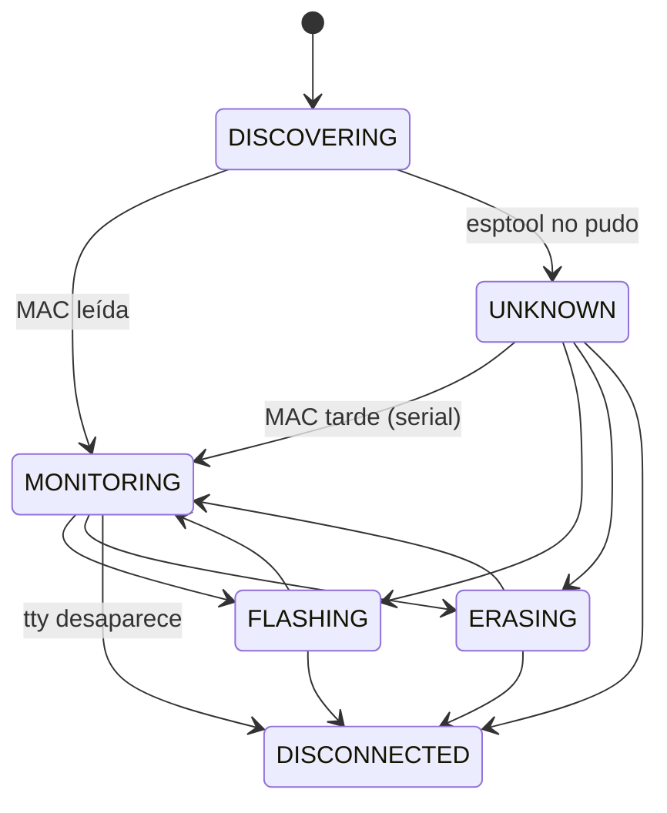

# espbench — Arquitectura

Flasheo remoto de ESP32 y monitor serie persistente. El developer compila en su
máquina; los ESP32 están enchufados a una Raspberry Pi que los flashea, los
monitorea y muestra todo en un dashboard web.

```
Máquina del developer                Raspberry Pi
─────────────────────                ─────────────────────────────────────────────
client/deploy.py ──TCP 5000+K──►  remote_esp32.py   (un proceso por device, en tmux)
                                    ├─ DeviceManager → TtyPort + Device (FSM) + DeviceLog
                                    ├─ EspMonitor     (esp_idf_monitor en un PTY)
                                    └─ control_server (protocol.py)
                                            │ escribe
                                            ▼
                                  /opt/esp/devices/<mac>/   log, events.jsonl, jobs, .elf
                                  /opt/esp/run/<tty>.json   estado runtime
                                            │ lee
Browser ◄──HTTP/WS 8080──────────  api.py (dashboard, proceso aparte)
```

---

## 1. Procesos

**Un proceso `remote_esp32.py` por device**, cada uno en su sesión tmux
(`esp32_<nombre>`), más **un proceso de dashboard** (`api.py`, systemd).

### Decisión: no consolidar los devices en un servicio único

El refactor de `feat/newArch` (`esp_ctrl`) reemplazó tmux por un servicio que
manejaba todos los devices, y terminó rompiendo todo. tmux por proceso da gratis
cuatro cosas que un servicio único tiene que reconstruir a mano:

1. **Aislamiento de fallas** — si se cuelga el monitor o esptool de un device,
   los demás siguen.
2. **Limpieza de recursos** — si el proceso muere, el sistema operativo cierra
   sus fds, PTYs y subprocesos.
3. **Reset por device** — `devremote --reset <dev>` mata y relanza solo ese.
4. **Attach interactivo** — `devremote <dev>` engancha la terminal de la sesión,
   que es donde funcionan Ctrl-E (erase) y el teclado hacia el monitor.

Consolidar no es imposible, pero requiere su propio diseño de supervisión. No
sale gratis de tener un buen modelo de objetos.

---

## 2. Modelo del device (`remote/server/device.py`)

| Objeto | Qué es | Vida |
|---|---|---|
| `TtyPort` | Puerto físico: path del tty + puerto TCP | Fijo durante toda la vida del proceso |
| `Device` | Identidad lógica, por MAC. FSM + `DeviceLog` | Arranca sin MAC; se *promueve* cuando la conoce |
| `DeviceManager` | Arma los dos, lee la MAC (con reintentos y fallback por serial), vigila que el tty siga existiendo | Uno por proceso |

`TtyPort` y `Device` están separados a propósito: el nombre del tty puede cambiar
(`ttyUSB3` → `esp-slot3`, ver §6) sin que nada del modelo lógico se entere.

### FSM



- `FLASHING`/`ERASING` vuelven al estado del que salieron. Si en el medio se
  resolvió la MAC, vuelven a `MONITORING`.
- **`UNKNOWN` puede flashear**: los chips con flash encryption no siempre dejan
  leer la MAC con esptool, y tienen que poder usarse igual.
- Las transiciones inválidas levantan `InvalidTransition`. Por ejemplo, un pedido
  de flash durante un erase se rechaza con `device_busy` antes de recibir el
  artefacto. Antes paraba el monitor en medio del erase.
- **Señales**: mientras `device.busy` (FLASHING/ERASING), el proceso ignora
  SIGTERM/SIGINT/SIGHUP, para no dejar un chip a medio escribir. Esto reemplaza
  al viejo `_ignore_signals_flag`.

Cada transición se loguea y se publica en `run/<tty>.json`.

---

## 3. Estado runtime (`remote/server/runstate.py`)

`/opt/esp/run/<tty>.json` es lo único que cruza de proceso a proceso. Lo escribe
el `Device` en cada transición, con escritura atómica (temp + `os.replace`). Lo
leen el dashboard (`DeviceRegistry`, `LogStreamer`), `esp32_tmux.sh` y
`devremote --status`.

```json
{"tty": "esp-slot3", "tty_path": "/dev/esp-slot3", "tcp_port": 5003,
 "mac": "1C:C3:AB:01:61:D4", "state": "monitoring",
 "log_path": "/opt/esp/devices/1CC3AB0161D4/output.log",
 "pid": 1234, "updated_at": "2026-10-05T16:00:00",
 "health": {"since": "...", "boots": 2, "panics": 1, "boot_loop": false,
            "last_reset": {"ts": "...", "reason": "TG1WDT_SYS_RESET", "abnormal": true},
            "last_panic": {"ts": "...", "kind": "guru", "detail": "LoadProhibited", "line": "..."}},
 "fw": {"project": "app", "version": "v1.2.3", "idf": "v5.3.2"}}
```

`health` y `fw` los arma `SerialWatch` (`serial_watch.py`) leyendo las mismas
líneas que van al log (se las pasa `DeviceLog`, §4): cuenta reinicios y panics,
detecta boot loop (3 boots en 2 min) y toma nombre/versión del firmware de lo que
imprime `app_init`. Lo mismo queda como eventos en `events.jsonl` (§4). Cuando cambian, el
`Device` republica sin transición (`publish()`). Al empezar un flash o un erase los
contadores vuelven a cero: esos reinicios son a propósito.

**Es por tty y no por MAC** porque es el estado del *proceso*, y antes de leer la
MAC no hay otra clave posible. Los datos que tienen que seguir a la placa (log,
jobs, `.elf`) sí van por MAC.

Si el `pid` está muerto, el dashboard lo toma como DOWN (un `kill -9` no limpia
el archivo). Si el estado es `disconnected`, `esp32_tmux.sh` recrea la sesión
cuando el tty vuelve.

---

## 4. Logs

### `DeviceLog` — único escritor del log de un device

Recibe el serial crudo (`EspMonitor` → `write_serial`) y las líneas de `taglog`
(flash, esptool, transiciones). Todo queda en un archivo, que es lo que muestra
el dashboard. Una sola tubería de líneas:

```
EspMonitor ─bytes→ DeviceLog.write_serial   decoder UTF-8 incremental, corte en \n
taglog ──────────→ DeviceLog.write_taglog
                     ├ escribe "<prefijo><línea>\n" (archivo binario, offset en bytes propio)
                     └ line_sink(texto, cursor, ts) = SerialWatch.on_line   (solo serial)
```

**Formato de línea**: `YYYY-MM-DD HH:MM:SS.mmm <origen> <cuerpo>`. Origen: `>`
serial, `|` taglog, `↪` continuación de una línea serial. El cuerpo de taglog es
`INFO  | tag            | msg` (en stdout/tmux el formato no cambió). La hora es la
del primer byte de la línea en la Pi. Los `\r` internos y el ANSI quedan como
llegaron (el dashboard y `SerialWatch` se quedan con el último segmento).

```
2026-10-05 16:02:03.123 | INFO  | devicelog      | sesión 20261005_160203_812 tty=esp-slot3
2026-10-05 16:02:03.130 > rst:0x1 (POWERON_RESET),boot:0x13 (SPI_FAST_FLASH_BOOT)
2026-10-05 16:02:05.002 | INFO  | device         | esp-slot3 (mac=…): monitoring -> flashing
2026-10-05 16:02:07.410 > esp>
2026-10-05 16:02:09.950 ↪ help
```

- **Línea parcial**: la línea serial en curso se retiene en memoria hasta el `\n`,
  hasta 150 ms sin bytes nuevos (un prompt de `esp_console` no termina en `\n`) o
  hasta 1 s desde su primer byte aunque sigan llegando (`MAX_HOLD`: una línea que
  gotea no queda retenida, y el desorden de horas queda acotado a ~1 s).
  Lo que llegue después de esa línea sale con `↪`. Así una línea de taglog de otro
  hilo nunca queda pegada a una serial. El flush por tiempo lo hace un hilo por
  `DeviceLog` que duerme en una `Condition` hasta el vencimiento (no hay que
  depender de que llegue otro byte ni de un tick externo). Una línea de más de
  4096 caracteres se corta (sigue con `↪`).
- **Sesión** = una ejecución del proceso: `session_id = YYYYMMDD_HHMMSS_<pid>` (el
  pid evita colisiones si el reloj salta). La primera línea del archivo es el
  header de sesión, escrito al abrir el archivo (fuera del buffer pre-MAC).
- **Cursor** = `c:<session_id>:<offset>`, offset en bytes, siempre en fin de
  línea. El cursor de una línea (y de un evento) es el **inicio** de esa línea,
  que es el fin de la anterior: `--since <cursor>` la incluye.
- **Un archivo por sesión**: `devices/<mac>/output.log` es la sesión actual. Al
  arrancar una nueva, la anterior rota a `output_<session_id>.log` (el id sale de
  su header; un log viejo sin header usa la hora actual).
- **Antes de saber la MAC**, las líneas quedan en memoria, con tope de 256 KB (se
  descarta desde el principio). Al adoptar: header, buffer y después el marcador
  `--- adoptado desde … ---`, así los offsets relativos al buffer siguen valiendo.
- **Si la MAC no se lee nunca** (`UNKNOWN`), el log va a
  `devices/unknown-<tty>/output.log`. Si la MAC aparece más tarde, ese contenido
  se copia al **principio** del archivo de la MAC (los offsets no cambian) y el
  provisorio se borra.

Reemplazó a `tmux pipe-pane`, que copiaba a ciegas lo que salía por la terminal,
y al `serial.log` que escribía `EspMonitor` y nadie leía.

### Eventos (`remote/server/events.py`) — `devices/<mac>/events.jsonl`

Una línea JSON por evento, con la hora y el cursor del log donde pasó:

```json
{"ts":"2026-10-05T16:02:03.123","type":"panic","cursor":"c:20261005_155000_812:48213",
 "detail":{"kind":"panic","reason":"LoadProhibited","line":"Guru Meditation Error: ..."},"by":"device"}
```

| type | Lo escribe | detail |
|---|---|---|
| `session` | `DeviceLog`, al abrir el archivo (cursor = offset 0) | tty, tcp_port, pid |
| `boot` | `SerialWatch`, en cada línea `rst:` | reason, abnormal |
| `fw` | `SerialWatch`: el primero de cada sesión y cada vez que cambia (al ver la línea `ESP-IDF:`, o en el siguiente `rst:`) | project, version, idf |
| `panic` | `SerialWatch` | kind, reason, line |
| `boot_loop` | `SerialWatch` | phase (`start`/`end`), boots; `end`: ts = último boot + ventana, `last_boot` {ts, cursor} |
| `state` | `Device` (FSM), en cada transición; evento y línea taglog bajo el lock del `DeviceLog` (`atomic()`) | from, to |
| `flash` | `protocol.py`, al armar la respuesta final | job_id, ok, status, error, user |
| `send` | api, en cada `POST /send` exitoso (cursor = antes del envío) | text, enter, user |
| `reserve` / `release` | api | user, expires |

- **Boot loop**: mientras está activo no se registran los `boot` sueltos (solo
  `start` con el conteo y `end`). El `end` se registra con la primera línea que
  llega después de que el loop venció, con el tick de cada segundo del proceso
  (`DeviceManager.tick` → `SerialWatch.poll`, así una placa muda también lo
  cierra y se republica la salud) o al empezar un flash/erase.
- `panic.kind`: `guru`, `abort`, `brownout`, `task_wdt`, `stack_overflow`, `assert`.
- Después de `close()` (desconexión) los eventos se descartan: no hay línea a la
  que apuntar.
- **Antes de la MAC** los eventos se retienen con su posición en el buffer y se
  recalculan al volcarlo. En la migración `unknown-<tty>` → MAC pasan **solo los
  eventos de la sesión actual** (el provisorio puede tener sesiones de otra placa).
- **Escritura**: `O_APPEND` y un solo `os.write()` por línea (< 4 KB), atómico en
  Linux entre procesos. Sin `flock`, sin ids, sin rotación. El archivo se crea con
  modo 666: el proceso del api (sfypi) también va a escribir.
- El proceso del api escribe con `events.record(log_path, type, detail)`: cursor =
  fin de la última línea completa del `output.log` en ese momento.

### `taglog` (`remote/server/taglog.py`)

`taglog.info(TAG, msg)` / `.warn` / `.error` / `.debug`, con un `TAG` estático
por módulo. Es la misma convención que `ESP_LOGI(TAG, ...)` del firmware.

Los sinks son pluggables (`add_sink`). Cada proceso de device tiene dos: stdout
(la sesión tmux, con `\r\n` porque la terminal está en modo raw) y su
`DeviceLog`.

---

## 5. Flash (`remote/server/protocol.py`)

Una conexión TCP = un pedido (`upload_and_flash`, `pull_and_flash` o `unlock`).

```
authenticate → validate_action → check_flashable (FSM) → LockStore
→ ACK {phase: ready} → receive_artifact (upload|pull + SHA256) → extract_artifact
→ monitor_paused [device.start_flash · mon.stop]
      verificar MAC → run_flash (erase? + write, reintento sin --encrypt si rc=2)
      → .elf a devices/<mac>/current.elf, last_user
  [mon.start · device.finish_flash]
→ {phase: done, ok, status, write_rc, ...}
```

- Cada paso es una función aparte, testeable con fakes (`tests/test_protocol.py`).
  Las herramientas externas (esptool, lectura de MAC) llegan en `FlashTools`.
- El job vive en `devices/<mac>/jobs/<job_id>/`, con su `job.log` adentro. Para
  un device sin MAC, en `jobs/<job_id>_<tty>/`.
- Toda respuesta final después del ACK (éxito, fallo de esptool, `device_changed`,
  SHA256 inválido...) queda también en `jobs/<job_id>/result.json` (`write_result`):
  es lo que muestra el historial del dashboard.
- **El lock queda por tty**, no por MAC, a propósito: `esp32_tmux.sh` lo libera
  al reconectar, y atarlo a la placa cambiaría ese comportamiento.

### Locks y reservas (`remote/server/locks.py`)

`locks/<tty>` = `user:token[:expires[:mac]]`. Sin vencimiento es el lock que toma
el flash (permanente hasta un unlock con el mismo par). Con vencimiento (epoch) es
una **reserva** (`POST /api/device/{tty}/reserve`, §8), con la MAC de la placa
(12 hex sin `:`, que es el separador del archivo).

- Reserva y flash usan **el mismo par** `lock_user`/`lock_token`: el flash del
  dueño de la reserva pasa, y `LockStore.acquire` conserva el vencimiento y la MAC
  (no la convierte en un lock permanente).
- **Vencido = inexistente** en todos lados (`LockStore`, `DeviceRegistry`, api):
  `locks.read()` lo borra al leerlo.
- **Reconexión**: `esp32_tmux.sh` borra solo los locks sin vencimiento (los del
  flash, como siempre). Una reserva vigente sobrevive el replug; al arrancar,
  `remote_esp32.py` la borra si su MAC no es la de la placa que encontró (los
  `ttyUSB` se renumeraron).
- Ni `user` ni `token` pueden tener `:` (el flash lo rechaza con
  `lock_credentials_required`).
- La escritura es atómica (temp + `os.replace`) y el archivo queda 666: lo escribe
  root (device) y lo borra sfypi (api); `locks/` es 777.

---

## 6. Nombres y puertos (`remote/infra/espbench-name`)

`ttyUSBN` es el orden en que el kernel enumeró los devices, no el puerto físico:
un replug o un reboot puede cambiarlo. `espbench-name` es **la única fuente** de
la regla de nombre y puerto. El proceso Python recibe el puerto ya resuelto por
`--control-port`.

| Caso | Nombre | Puerto TCP |
|---|---|---|
| Sin `/opt/esp/slots.conf` | `ttyUSBN` | `5000+N` (comportamiento histórico) |
| Puerto físico mapeado en `slots.conf` | `esp-slotK` | `5000+K` |
| Hay `slots.conf` y el device no está mapeado | `ttyUSBN` | `5100+N` (no choca con los slots) |

`slots.conf` tiene una línea por puerto físico del hub: `<K> <ID_PATH>`.
`devremote --slots` muestra el `ID_PATH` de lo que está enchufado. Una regla udev
crea el symlink `/dev/esp-slotK` y la sesión corre sobre él, así que la sesión,
el estado runtime y el lock quedan atados al puerto físico.

---

## 7. Sesiones y hotplug (`remote/infra/`)

```
enchufar ──► udev (99-esp32.rules) ──► systemd espbench-attach@ttyUSBN
                                            └─► devremote --start (como sfypi)
boot ─────► devremote.service ─────────────────► devremote (escanea /dev/ttyUSB*)
                                                      └─► esp32_tmux.sh /dev/ttyUSBN
                                                             └─► tmux esp32_<nombre>: remote_esp32.py
```

- El hotplug pasa por systemd y no por `RUN+=` de udev. Lo que udev lanza corre
  en el tmux server de root y se mata al terminar el evento. La regla anterior
  hacía eso, y en la práctica el hotplug no funcionaba.
- `devremote`: `--status`, `--reset [<dev>]`, `--unlock <dev>`, `--slots`,
  `--cleanup`, `<dev>` (attach). `<dev>` acepta `N`, `ttyUSBN`, `esp-slotK` o
  `slotK`.
- Desconexión: el watcher del proceso ve que el tty desapareció → `DISCONNECTED`
  → el proceso termina. Cuando el tty vuelve, `esp32_tmux.sh` recrea la sesión.

---

## 8. Dashboard (`remote/server/api.py` + `remote/dashboard/`)

| Endpoint | |
|---|---|
| `GET /api/devices`, `GET /api/device/{tty}`, `GET /api/device/by-key/{key}` | `DeviceRegistry` |
| `PATCH /api/devices/{mac}` | Renombrar (`devices.json`) |
| `POST /api/device/{tty}/unlock` | Liberar lock |
| `POST /api/device/{tty}/reserve` `{lock_user, lock_token, ttl_s, expect_mac}` | Reserva con vencimiento (§5); 409 `locked` si la tiene otro; renueva si es propia |
| `POST /api/device/{tty}/release` `{lock_user, lock_token}` | Suelta el lock con el mismo par (403 si no) |
| `POST /api/device/{tty}/command/{reset\|bootloader}` | Teclas al monitor vía `tmux send-keys`. Body opcional: `expect_mac`, par del lock, `force` |
| `POST /api/device/{tty}/devremote-reset` | `devremote --reset <tty>` |
| `GET /api/device/{tty}/jobs`, `.../jobs/{job_id}/log` | Historial de flasheos (`history.py`, `result.json`) |
| `GET /api/device/{tty}/sessions`, `.../sessions/{name}[?download=1]` | Sesiones de log (actual + rotadas) |
| `POST /api/device/{tty}/send` `{text, enter, expect_mac?, lock_user?, lock_token?, force?}` | Texto al serial vía `tmux send-keys -l`; 409 `busy` si flashea/borra. Devuelve `cursor` (fin del log antes del envío) y registra el evento `send` |
| `WS /ws/device/{tty}` | `LogStreamer`: el log del device en vivo |
| `GET /api/board/{key}/log?since=&until=&around=&before=&after=&max_lines=&grep=&src=&raw=&echo=` | Rango del log de una placa (`logrange.py`, ver abajo) |
| `GET /api/board/{key}/events?type=a,b&since=&limit=` | Eventos de la placa, ordenados por (sesión, offset) |

- **Token (opcional)**: si existe `/opt/esp/api_token` (`auth.py`, se lee en cada
  pedido), las escrituras (POST/PATCH) exigen `Authorization: Bearer <token>` →
  401 `auth`; las lecturas siguen abiertas. Es también el token del flash si la
  sesión no recibe `--token` (A2): con el archivo creado, un `.flashcfg.json` sin
  `token` deja de flashear. El dashboard (`auth.js`) lo pide una vez ante un 401 y
  lo guarda en `localStorage`.
- **Errores** de las escrituras (y de `/api/board`): `{"detail": {"error", "message"}}`.
  `error` es el contrato del CLI (spec §8.3): `bad_request`, `busy` (409),
  `device_changed` (409: `expect_mac` no es la MAC del tty), `locked` (423: placa
  reservada por otro; 409 en `reserve`), `token_mismatch` (403), `not_found`,
  `bad_anchor`, `cursor_expired`.
- **Reservas (A3)**: una reserva vigente bloquea `send`/`command` de cualquiera que
  no mande el mismo par (423). El lock permanente del flash no bloquea. `force:
  true` la saltea: el dashboard lo manda después de confirmar.
- `send`, `reserve` y `release` quedan en `events.jsonl` (`events.record`, cursor =
  fin del log en ese momento; el de `send` es el previo al envío y solo se
  registra si tmux lo mandó).
- **Lecturas por placa** (`/api/board/{key}`): `key` = `device_key`, SN o MAC (con
  o sin separadores), resuelto con `devices.json` (`DevicesFile.resolve_board`).
  Funcionan con la placa desconectada (los datos viven en `devices/<MAC>/`); la
  sesión "actual" de una placa desconectada es la última. Escrituras por tty, con
  `expect_mac`.

### Rangos del log (`remote/server/logrange.py`, spec §5 y §7.3)

- **Anchors** (`since`, `around`): `now`, `session`, un tipo de evento con ordinal
  (`boot`, `panic~1`: en la sesión actual, ordenados por offset, no por orden en
  el archivo), tiempo (`5m`, `16:02`, `2026-10-05T16:02`, zona de la Pi; una hora
  posterior a ahora es de ayer) y cursores `c:<sesión>:<offset>` (a mitad de línea
  → inicio de la línea; sesión que ya no está → `cursor_expired`). `since` default:
  `session`.
- **Tiempo**: búsqueda lineal hacia atrás hasta una línea con hora < T − 2 s (las
  horas del archivo no son monótonas, §4) y hacia adelante hasta la primera ≥ T.
  Las líneas sin prefijo no cuentan.
- **`until`**: el primer X después de `since`, en la misma sesión. Un tipo de
  evento sale de `events.jsonl`, leído **después** de fijar el tamaño del log (un
  evento que no estaba aparece con cursor ≥ `end` en el próximo poll); `boot` y
  `panic` se buscan en las líneas con la detección de `SerialWatch` (`line_kind`),
  porque el evento se escribe un instante después que su línea. Un patrón
  (`re:<regex>` o substring) se evalúa sobre el texto sin prefijo ni ANSI, con el
  `\r` aplicado y sobre la línea lógica (`>` + sus `↪`, aunque haya taglog en el
  medio). `echo=<texto>`: la primera línea lógica que termina con él (el eco de
  `send`) no cuenta. Sin match: `until_found: false`, `end` = fin del log.
- **`around`**: del `rst:` anterior a E (inclusive) al siguiente (exclusive), o
  `before`/`after` líneas. No se combina con `since`/`until`.
- **Salida**: líneas compactas (`HH:MM:SS.mmm <origen> <texto>`, con fecha si no es
  la de `date`), sin ANSI salvo `raw=1`, progreso de esptool colapsado, `src`
  (`serial`/`taglog`/`all`), `grep`, y con más de `max_lines` (default 200, tope
  5000) las primeras 50 + las últimas y un marcador. `session_ended`: la sesión del
  rango no es la actual o no hay proceso vivo escribiéndola. `partial` siempre es
  `null`: la línea en curso vive en la memoria del proceso del device (sale al
  archivo a los 150 ms / 1 s).
- Las rutas `/api/device/{tty}/...` de GET tienen que declararse **antes** de
  `/api/device/{tty:path}`, que si no se las come (hay test).
- `DeviceRegistry` lista un device por puerto físico (`esp-slotK` en vez del
  `ttyUSB` al que apunta). El estado, la MAC y el puerto salen de
  `run/<tty>.json`. Sin estado runtime, cae al esquema anterior (`tmux
  has-session`, `logs/<tty>/mac`).
- `LogStreamer` sigue el `log_path` que publica el device. Cuando el archivo rota
  (cambió el inode), lo lee desde el principio.
- `devices.json` (MAC → nombre amigable + modelo de HW) lo comparten todos los
  procesos. La escritura es con `flock`, y el `flush`+`fsync` se hace **antes**
  de soltar el lock: sin eso, dos `register_mac` simultáneos corrompían el
  archivo (pasaba con `devremote --reset`).

---

## 9. Filesystem en la Pi

```
/opt/esp/
├── server/                código (copia de remote/server/)
├── dashboard/             frontend (copia de remote/dashboard/)
├── venv/                  Python + esptool + esp-idf-monitor + fastapi
├── devices.json           MAC → {device_key, hw_model}
├── slots.conf             (opcional) <K> <ID_PATH>
├── run/<tty>.json         estado runtime de cada sesión
├── devices/<MAC>/
│   ├── output.log         log de la sesión actual (con header de sesión)
│   ├── output_<session_id>.log  sesiones anteriores (output_<ts>.log: logs viejos)
│   ├── events.jsonl       eventos de la placa (todas las sesiones)
│   ├── current.elf        para decodificar backtraces
│   ├── last_user
│   └── jobs/<job_id>/     artefacto extraído + job.log
├── devices/unknown-<tty>/ log y eventos de un device sin MAC
├── locks/<tty>            "user:token[:expires[:mac]]" (lock del flash / reserva)
├── api_token              (opcional) token de las escrituras del API y del flash
└── jobs/, logs/, current_<tty>.elf   esquema anterior / devices sin MAC
```

`devremote --cleanup` borra jobs y sesiones de log viejas. La sesión actual
nunca se toca.

---

## 10. Tests

`pytest tests/`, en el host y sin hardware. `tests/conftest.py` aísla `ESP_BASE`,
así que ningún test toca el `/opt/esp` real.

| Qué | Cómo |
|---|---|
| Modelo, FSM, `DeviceLog`, `SerialWatch`, `events`, `runstate`, `taglog`, `paths` | unitarios (eventos: dos procesos escribiendo el mismo archivo) |
| `protocol.py` | pedido completo por `socketpair`, esptool falso (`test_protocol.py`) |
| Entrypoint | `remote_esp32.main()` con fakes solo en esptool/monitor/TCP (`test_remote_esp32.py`) |
| Scripts de infra | los scripts reales con `tmux`/`udevadm`/`pkill` falsos (`test_infra.py`) |
| Dashboard | `DeviceRegistry`, `LogStreamer` (rotación, `log_path` por estado runtime), `history`, endpoints de `api.py` llamados directo (`test_api.py`) |
| Frontend | lógica de `remote/dashboard/espbench.js` con `node --test` (`tests/js/`, lo corre `test_dashboard_js.py`) |

**Solo se verifica en la Pi**: la regla udev de slots, el hotplug vía systemd, y
el comportamiento real de `esp_idf_monitor`/esptool con hardware (flash, erase,
MAC por serial, desconexión física). Del dashboard: que `SerialWatch` cuente un
panic real (y vuelva a cero al flashear), y que la consola serie (`tmux send-keys`)
le llegue al firmware a través de `esp_idf_monitor`. Del log y los eventos: que
los offsets de los cursores caigan en la línea correcta con `esp_idf_monitor` real
(sus `\r\n`, colores y líneas decodificadas de backtrace), que el prompt de
`esp_console` salga a los 150 ms y el eco con `↪`, que el `boot` coincida con cada
reset real, y que tras un reboot sin red `devremote.service` arranque igual
(drop-in de 90 s a `systemd-time-wait-sync`) y con red espere a NTP.
